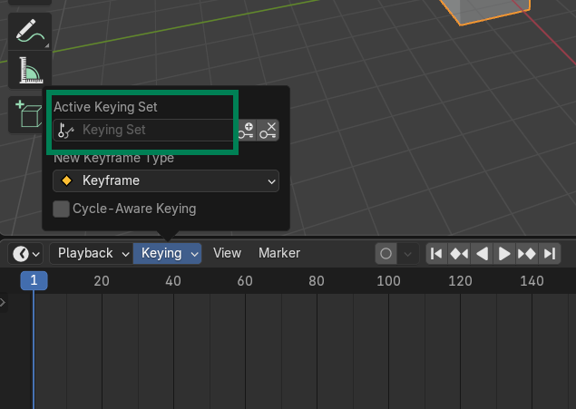
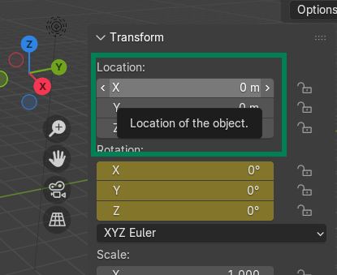
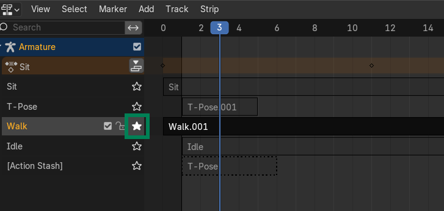
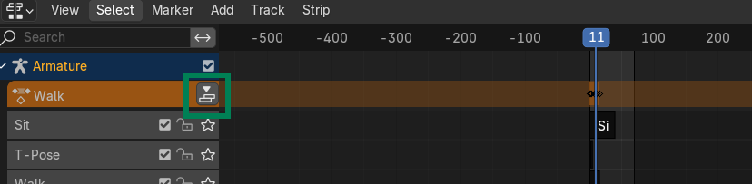

# Animator Guide

This is a general guide for working with Blender and how this web application expects animations to be. There are some things to consider to make rigs work with a variation of mesh sizes.

## Blender Source files

I am using Blender 4.5. All the source files are in the "blender" folder at the location of this readme. There are two variations of the blender files for each rig
 - **RIG**-model.blend - Contains no animations. This has things like mirror modifiers applied to help with modeling
 - **RIG**.blend - Has the skeleton + model + animations.

When you make changes or create a new 3d model, export to GLB and place it in the "models" folder. This models folder is what the web app will use when loading the reference models.

## Rigs and animations

The rig files are in the "blender" folder with the name <RIG>.blend. If I am making a new one, I create **RIG**.blend file with the new rig type. I import the associated GLB file from the "models" folder. I then proceed to build out the armature. 

### Things to consider

#### Rotation keyframes

When creating animations, we generally only want to make rotation keyframes. This is because people import 3d models in Mesh2Motion that have different sized limbs. We want to make sure their limbs don't get shortened or elongated. If we make position keyframes, this can affect the results. This also makes for a smaller size animations.

When starting a new rig file, one of the first things to do is change the "Keying" type to help with this. This is set in the timeline here.

Make sure to set this to "Rotation". When we are animating bones around later and want to make a keyframe, we can press the "I" shortcut. Pressing this shortcut will not only create a keyframe for the rotation property.

### Hip bone positions

In general we only use rotation keyframes. The hip bone is the only exception. This is needed to help with things like jumping or falling where we really need the hip bone to move the entire model. 

The easiest way I have found to do this is position the hip bone where you want, then hover over the location transform area and press the "I" shortcut key. The keyframe should change colors indicating there is a keyframe there. YOu can remove the position keyframe with "Shift + Alt + I".

### No root motion

For each rig, there is a root bone that should be at the origin (0,0,0). This is the parent of all the bones. Currently Mesh2Motion doesn't support root motion, so don't keyframes to that for now. Any root motion will be stripped out when Mesh2Motion loads an animation. 

## Existing rigs output

When the Blender animations are ready, you can export out the skeleton by itself in the "skeletons" folder as a GLB. I usually remove all the animations from the skeleton to make the skeleton size smaller. 

The final animations go in the "animations" folder. It is a GLB with everything exported: mesh, skeleton, and animations. The reason we put everything in the file is that it will be used for animation previews. 

# New Rig setup
There will need to be programming work to actually see and test a new rig in Mesh2Motion.  Before the programming work can start you can export the following into the directories

- models - put the GLB of the mesh only
- skeletons - put the GLB of the skeleton only
- animations - put the GLB of the mesh + skeleton + animations

There needs to be a few places in code to add a new rig
- index.html: Add an option for the model. Add an option for the skeleton
- script.js - TODO: add references to whatever this is when I do it next

## Blender usage notes

The main window the animations are stored at are in the non-linear animation(NLA) window. To see an animation, make sure you have the skeleton selected in pose mode, then click the star icon by the animation you want to view. Scrub around to see the animation.

For editing and creating animation keyframes, I use the Dope sheet. From there, I change the sub-view of it to the Action editor. You can change between animations and create new animations this way.

For new actions that are made in the action editor, you will need to add them to the NLA editor. To do this go to your new action in the action editor. Then in your NLA, you can "push down" the new action to add it.

